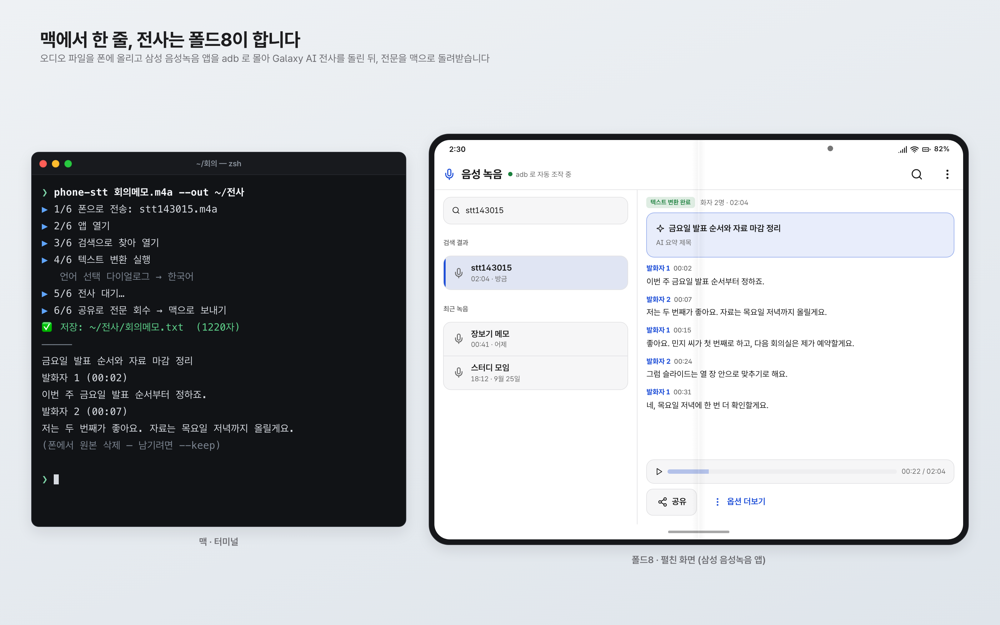
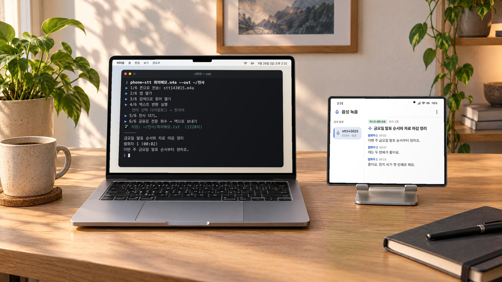
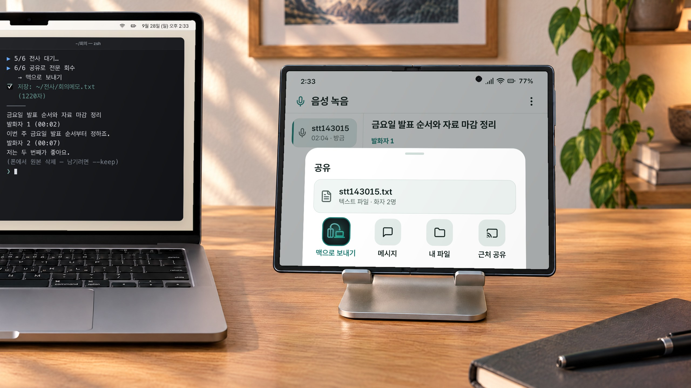
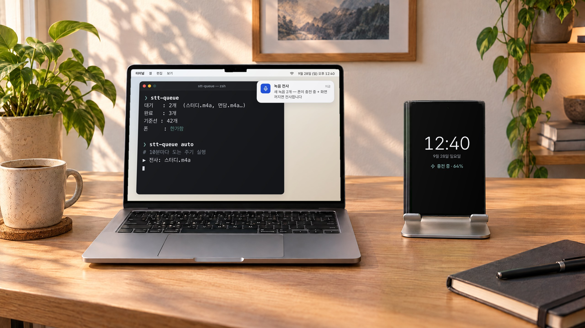
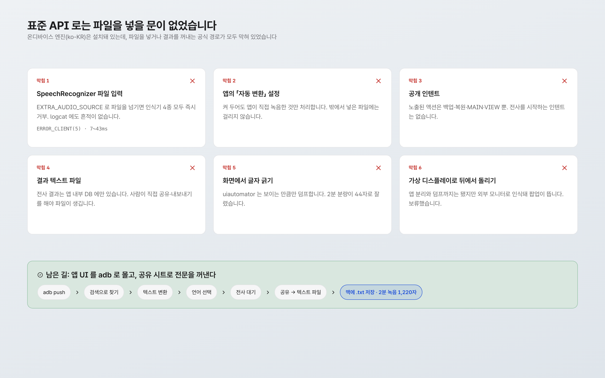
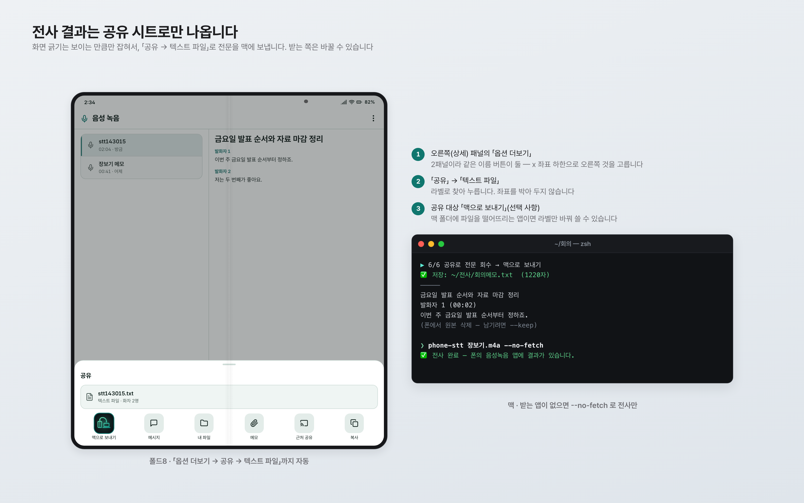
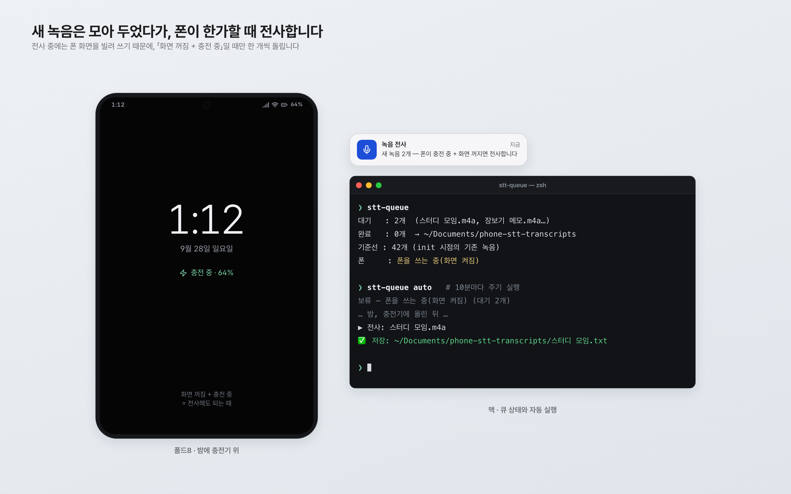
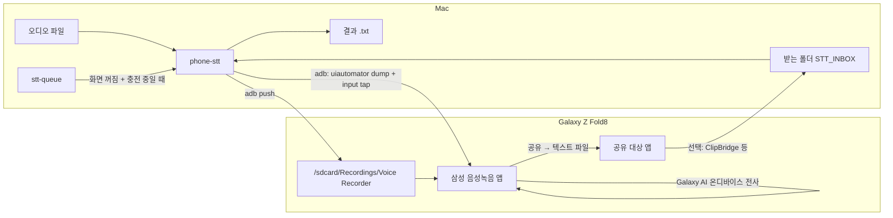

# galaxy-ondevice-stt

폴드8을 무료 온디바이스 STT 서버로 씁니다. 맥의 오디오 파일을 폰에 올려 삼성 음성녹음 앱의 Galaxy AI 전사를 돌리고, 전문을 맥으로 돌려받습니다.

> **English** — Turns a Galaxy Z Fold8 into a free, on-device speech-to-text server for a Mac: push an audio file, drive Samsung Voice Recorder's Galaxy AI transcription over adb, and pull the full transcript back.
> Android's standard `SpeechRecognizer` file input and five other official routes were closed on this device, so this is UI automation (uiautomator labels and resource-ids, no hard-coded coordinates except one).
> Samsung devices only; it breaks whenever One UI changes the Voice Recorder screens.

동작 확인: Galaxy Z Fold8 (Android 17) · macOS 26


화면은 설명용 목업입니다.

## 왜 만들었나

저는 아이폰을 10년 가까이 쓰다가 갤럭시 Z 폴드8로 옮겼습니다. 아이폰과 맥 사이에서 당연하게 쓰던 연동이 없어서, 필요한 것을 하나씩 직접 만들어 보는 중입니다. 이 저장소는 그중 하나입니다.

폴드8에 들어 있는 삼성 음성녹음 앱은 녹음을 기기 안에서 텍스트로 바꿔 줍니다. 화자를 나누고 타임스탬프를 붙이고 요약 제목까지 답니다. 요금이 없고 음성이 폰 밖으로 나가지 않습니다. 저는 이걸 맥에서 명령 한 줄로 부르고 싶었습니다. 강의나 회의 녹음을 맥에 두고 전사만 폰에 맡기는 식으로요.

## 실제로 이렇게 씁니다


맥에서 `phone-stt 회의메모.m4a` 한 줄 → 옆에 세워 둔 폴드8이 음성녹음 앱을 스스로 열어 전사하고, 결과가 맥의 `.txt` 로 떨어집니다.


전사가 끝나면 폰에서 공유 시트가 자동으로 열리고 「맥으로 보내기」로 전문이 넘어옵니다 → 맥 터미널에 저장 경로와 글자 수가 찍힙니다.


점심시간에 폰을 충전 스탠드에 올려 두면 → `stt-queue auto` 가 「한가함」을 확인하고 쌓인 녹음을 하나씩 전사합니다.

책상 사진은 AI로 만든 배경이고, 화면은 설명용 목업을 합성했습니다.

## 스크린샷


화면은 설명용 목업입니다.


화면은 설명용 목업입니다.


화면은 설명용 목업입니다.

## 기능

- **`phone-stt <파일>`** — 오디오 파일 하나를 폰에서 전사해 같은 이름의 `.txt` 로 저장합니다.
  - 폰에 올릴 때 이름을 `sttHHMMSS` 로 짧게 바꿉니다. 목록 UI 가 긴 이름을 말줄임해서 못 찾는 일이 있었습니다(31자는 실패, 9자는 성공).
  - 앱을 열고, 검색으로 파일을 찾고, 「텍스트 변환 어시스트 → 텍스트 변환」을 누르고, 「언어 선택」 다이얼로그가 뜨면 언어를 고릅니다.
  - 버튼은 좌표가 아니라 `uiautomator dump` 의 라벨과 resource-id 로 찾습니다. 사이드바 탭 하나만 좌표이고, 설정으로 바꿀 수 있습니다.
  - 전사가 화면에 나타날 때까지 최대 450초 기다립니다.
  - 「옵션 더보기 → 공유 → 텍스트 파일」로 전문을 맥에 보내 받습니다(아래 「전사문 회수」). UTF-16 으로 오는 파일을 UTF-8 로 바꿔 저장합니다.
  - 회수한 뒤에는 `STT_INBOX` 에 떨어진 그 파일을 지우고(내용은 `.txt` 로 옮겨 둔 뒤), 폰에 올린 오디오 사본도 지웁니다(`--keep` 이면 남김). `--no-fetch` 로 전사만 할 때는 폰 사본을 지우지 않습니다.
- **`stt-queue`** — 맥 폴더에 새 녹음이 생기면 큐에 넣어 두고, 폰이 「화면 꺼짐 + 충전 중」일 때만 한 개씩 전사합니다. 전사하는 동안 폰 화면을 쓰기 때문입니다. 세 번 실패한 파일은 건너뜁니다.
- **`lib-device.sh`** — 무선 adb 기기를 찾습니다. mDNS → 기본 게이트웨이(맥이 폰 핫스팟에 붙은 경우) → Tailscale 순서입니다.

실측 한 건: 사람 셋이 말한 2분 녹음이 1,220자 전문으로 돌아왔습니다. 화자 라벨, 발화 단위 타임스탬프, AI 요약 제목이 붙어 있었습니다. 같은 녹음 15초 구간을 ElevenLabs Scribe 결과와 대조했을 때 문장 내용은 거의 같았고 쉼표와 띄어쓰기만 조금 달랐습니다.

## 구조



## 준비물

- 삼성 갤럭시 기기와 기본 음성녹음 앱(`com.sec.android.app.voicenote`), Galaxy AI 전사가 되는 모델. 저는 폴드8에서만 확인했습니다.
- 맥: `adb`(Android SDK platform-tools), `python3`, `bash`
- 폰과 맥의 무선 adb 페어링(개발자 옵션 → 무선 디버깅)
- 선택: 전사문을 맥 폴더로 받아 줄 공유 대상 앱. 저는 직접 만든 ClipBridge 를 씁니다(「전사문 회수」 참고).
- 선택: `terminal-notifier` (stt-queue 알림), Tailscale (다른 망에서 adb 연결)

## 설치

```bash
git clone https://github.com/joonlab/galaxy-ondevice-stt.git
cd galaxy-ondevice-stt
mkdir -p ~/.local/bin
ln -s "$PWD/bin/phone-stt" "$PWD/bin/stt-queue" ~/.local/bin/

mkdir -p ~/.config/galaxy-ondevice-stt
cp config.example.env ~/.config/galaxy-ondevice-stt/config.env
```

## 설정

`~/.config/galaxy-ondevice-stt/config.env` 에 적습니다. 같은 이름의 환경변수가 있으면 그쪽이 먼저입니다. 전체 목록은 [`config.example.env`](config.example.env) 에 있습니다.

| 키 | 뜻 | 기본값 |
|---|---|---|
| `PHONE_ADB` | adb 기기 ID(`ip:port`) | 비우면 자동 탐색 |
| `STT_INBOX` | 공유된 전사 파일이 떨어지는 맥 폴더 | 비우면 회수 안 함 |
| `STT_SHARE_TARGET` | 공유 시트에서 누를 대상 라벨 | `맥으로 보내기` |
| `STT_LANG` | 언어 선택 다이얼로그에서 고를 언어 | `한국어` |
| `STT_SIDEBAR_TAP` | 사이드바 「음성 녹음」 탭 좌표 | `120 508` (폴드8 펼친 화면) |
| `STT_DETAIL_MIN_X` | 2패널에서 오른쪽 패널로 볼 x 하한 | `1150` |
| `STT_REC_DIRS` | stt-queue 가 볼 녹음 폴더(콜론 구분) | — |
| `STT_OUT_DIR` | stt-queue 결과 폴더 | `~/Documents/phone-stt-transcripts` |

### 사용

```bash
phone-stt 회의메모.m4a                 # → 회의메모.txt
phone-stt 강의.m4a --out ~/전사 --keep  # 결과 폴더 지정, 폰 사본 남김
phone-stt 장보기.m4a --no-fetch        # 전사만 하고 결과는 폰 앱에 둠

stt-queue init     # 처음 한 번: 지금 있는 녹음은 자동 대상에서 뺌
stt-queue          # 상태
stt-queue auto     # 조건이 맞으면 1개 전사 (주기 실행용)
stt-queue run 3    # 조건 무시하고 지금 3개
```

`stt-queue auto` 는 launchd, cron 등으로 10분쯤마다 부르면 됩니다. 녹음 폴더가 `~/Desktop`·`~/Documents` 같은 보호 폴더 안에 있으면 새 LaunchAgent 가 macOS 개인정보 보호(TCC)에 막힐 수 있습니다. 저는 이미 권한이 있는 상주 프로세스에서 부르는 방식으로 피했습니다.

### 전사문 회수 (ClipBridge 는 선택)

삼성 앱은 전사 결과를 앱 내부 DB 에만 둡니다. 결과 파일은 사람이 공유나 내보내기를 해야 생기고, 화면에서 글자를 긁으면 보이는 만큼만 잡힙니다. 그래서 `phone-stt` 는 공유 시트로 「텍스트 파일」을 보내고, 맥의 `STT_INBOX` 폴더에 새 파일이 생기기를 60초까지 기다립니다.

- 저는 공유 대상으로 직접 만든 ClipBridge(맥↔폰 브리지 앱)를 씁니다. 공유 시트에 「맥으로 보내기」로 나오고, 받은 파일을 맥 폴더에 떨어뜨립니다. 확인한 조합은 이것 하나입니다.
- 공유 시트에서 한 번 눌러 맥 폴더에 파일을 떨어뜨리는 앱이면 `STT_SHARE_TARGET` 라벨과 `STT_INBOX` 만 바꿔 쓸 수 있을 겁니다. 다른 앱으로는 시험하지 않았습니다.
- 받는 앱이 없으면 `STT_INBOX` 를 비워 두거나 `--no-fetch` 를 쓰세요. 전사까지만 하고, 결과는 폰의 음성녹음 앱에서 직접 공유하면 됩니다.

## 알려진 한계

- **삼성 기기 전용**이고, One UI 가 음성녹음 앱 화면을 바꾸면 깨집니다. 라벨(「텍스트 변환 어시스트」「옵션 더보기」 등)과 resource-id 에 의존합니다. 한국어 UI 기준입니다.
- 사이드바 탭 하나는 좌표(`STT_SIDEBAR_TAP`)입니다. 폴드8 펼친 화면 기준이라 다른 기기에서는 직접 맞춰야 합니다.
- **전사하는 동안 폰 화면을 씁니다.** 가상 디스플레이로 뒤에서 돌리는 방법은 앱 분리와 덤프까지는 됐지만, 기기가 외부 모니터로 인식해 팝업을 띄워서 보류했습니다.
- `phone-stt` 단건은 처음부터 끝까지 자동으로 도는 것을 확인했습니다. `stt-queue` 의 「새 녹음 감지 → 한가할 때 자동 전사」는 코드와 조건 판정까지만 만들었고, 실제 새 녹음이 이 경로로 전사된 기록은 아직 없습니다.
- adb 는 절전 중에 자주 끊깁니다(한 세션에 3번 겪었습니다). 매일 돌리는 흐름을 adb 에 전부 맡기기에는 약합니다.
- 합성음(macOS `say`)으로 시험하면 인식이 크게 무너집니다. 파이프라인 점검용으로는 괜찮지만 품질 판단에는 사람 목소리를 쓰세요.
- 전사된 내용은 폰의 음성녹음 앱에도 남습니다. `--keep` 을 안 줘도 지우는 것은 폰에 올린 오디오 사본뿐입니다.

## 만든 과정

2026년 9월 20~21일 이틀 동안 Claude Code 와 같이 만들었습니다. 코드보다 막힌 길을 확인하는 데 시간이 더 들었습니다.

1. **표준 API 는 엔진이 있어도 문이 닫혀 있었습니다.** `SpeechRecognizer` 에 `EXTRA_AUDIO_SOURCE` 로 파일을 넘기면 인식기 4종이 모두 `ERROR_CLIENT` 로 즉시 거부했고, logcat 에는 아무것도 남지 않았습니다. 한국어 온디바이스 모델은 설치돼 있었습니다. 자동 변환 설정, 공개 인텐트, 결과 파일 자동 생성, 화면 긁기, 가상 디스플레이까지 여섯 경로를 확인하고 나서야 UI 자동화로 갔습니다. 중간에 탭을 잘못 봐서 「삼성 앱이 외부 파일을 못 읽는다」고 한 번 잘못 결론 낸 적도 있습니다.
2. **보이는 것만 잡힙니다.** `uiautomator` 로 전사문을 읽으면 2분 분량이 44자로 잘렸습니다. 목록도 날짜순이라 옛 파일은 화면 밖에 있어서 덤프에 안 나옵니다. 그래서 스크롤 대신 검색을 쓰고, 결과는 공유 시트로 꺼냅니다.
3. **조용히 멈추는 단계가 제일 무섭습니다.** 하루 뒤 「텍스트 변환」 다음에 「언어 선택」 다이얼로그가 새로 뜨기 시작했고, 스크립트는 에러 없이 450초를 기다리다 끝났습니다. 확인 버튼 라벨이 앞 메뉴와 똑같은 「텍스트 변환」이라, 글자가 아니라 resource-id(`select_language_trans_text`)로 집도록 고쳤습니다.
4. **폴더블은 같은 버튼이 두 개입니다.** 펼친 화면이 2패널이라 「옵션 더보기」가 목록과 상세에 하나씩 있습니다. x 좌표 하한을 줘서 오른쪽 것을 고릅니다.

<!-- VIDEO:START -->
### 홍보 영상

[](https://pub-81d14e6ebfb841109968e9c0ee057d1b.r2.dev/android-mac-lab/videos/galaxy-ondevice-stt/galaxy-ondevice-stt_16x9.mp4)

▶ [가로 16:9 · 72초](https://pub-81d14e6ebfb841109968e9c0ee057d1b.r2.dev/android-mac-lab/videos/galaxy-ondevice-stt/galaxy-ondevice-stt_16x9.mp4) · ▶ [세로 9:16 · 64초](https://pub-81d14e6ebfb841109968e9c0ee057d1b.r2.dev/android-mac-lab/videos/galaxy-ondevice-stt/galaxy-ondevice-stt_9x16.mp4) — 영상 속 화면은 설명용 목업이고, 책상 사진은 AI로 만든 배경입니다.
<!-- VIDEO:END -->

## 관련 프로젝트

- 허브: [android-mac-lab](https://github.com/joonlab/android-mac-lab) — 폴드8과 맥을 잇는 제 다른 도구들을 모아 둔 곳입니다.

## 라이선스

MIT — [LICENSE](LICENSE)
